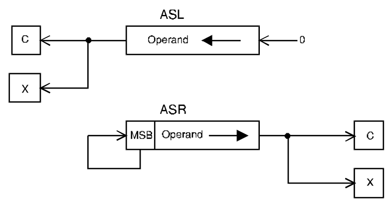

# ASL, ASR - Arithmetic shift left/right

## Operation
[destination] ← [destination] shifted by \<count\>

## Syntax
```assembly
ASL Dx,Dy
ASR Dx,Dy
ASL #<data>,Dy
ASR #<data>,Dy
ASL <ea>
ASR <ea>
```

## Attributes
`Size` byte, word, longword

## Description
Arithmetically shift the bits of the operand in the specified direction (i.e., left or right). The shift count may be specified in one of three ways. The count may be a literal, the contents of a data register, or the value 1. An immediate (i.e., literal) count permits a shift of 1 to 8 places. If the count is in a register, the value is modulo 64 (i.e., 0 to 63). If no count is specified, one shift is made (i.e., `ASL <ea>` shifts the contents of the *word* at the effective address one place left).<br/>
The effect of an arithmetic shift left is to shift a zero into the least-significant bit position and to shift the most-significant bit out into both the X- and the C-bits of the *CCR*. The overflow bit of the *CCR* is set if a sign change occurs during shifting (i.e., if the most-significant bit changes value during shifting).<br/>
The effect of an arithmetic shift right is to shift the least-significant bit into both the X- and C-bits of the CCR. The most-significant bit (i.e., the sign bit) is *replicated* to preserve the sign of the number.



## Application
`ASL` multiplies a two's complement number by 2. `ASL` is almost identical to the corresponding logical shift, `LSR`. The only difference between `ASL` and `LSL` is that `ASL` sets the V-bit of the CCR if overflow occurs, while `LSL` clears the V-bit to zero. An `ASR` divides a two's complement number by 2. When applied to the contents of a memory location, all 68000 shift operations operate on a word.

## Condition codes
|X|N|Z|V|C|
|--|--|--|--|--|
|*|*|*|*|*|

The X-bit and the C-bit are set according to the last bit shifted out of the operand. If the shift count is zero, the C-bit is cleared. The V-bit is set if the most-significant bit is changed at any time during the shift operation and cleared otherwise.

### Destination operand addressing modes
|Dn|An|(An)|(An)+|&#x2011;(An)|(d,An)|(d,An,Xi)|ABS.W|ABS.L|(d,PC)|(d,PC,Xn)|imm|
|:-:|:-:|:-:|:-:|:-:|:-:|:-:|:-:|:-:|:-:|:-:|:-:|
|✓||✓|✓|✓|✓|✓|✓|✓||||

*From MOTOROLA M68000 FAMILY Programmer's reference manual. Copyright 1992 by Motorola Inc./NXP. Adapted with permission.*