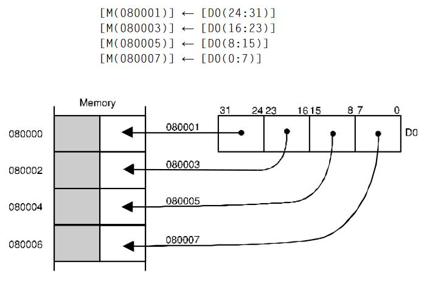

# MOVEP - Move peripheral data

## Operation
[destination] ← [source]

## Syntax
```assembly
MOVEP Dx,(d,Ay)
MOVEP (d,Ay),Dx
```

## Sample syntax
```assembly
MOVEP D3,(Control,A0)
MOVEP (Input,A6),D5
```

## Attributes
`Size`  word, longword

## Description
The `MOVEP` operation moves data between a data register and a byte-oriented memory mapped peripheral. The data is moved between the specified data register and *alternate bytes* within the peripheral's address space, starting at the location specified and incrementing by two. This instruction is designed to be used in conjunction with 8-bit peripherals connected to the 68000's 16-bit data bus. The high-order byte of the data register is transferred first and the low-order byte transferred last. The memory address is specified by the address register indirect mode with a 16-bit offset. If the address is even, all transfers are to or from the high-order half of the data bus. If the address is odd, all the transfers are made to the low-order half of the data bus.

## Application
Consider a memory-mapped peripheral located at address $08 0001 which has four 8-bit internal registers mapped at addresses $08 0001, $08 0003, $08 0005, and $08 0007. The longword in data register D0 is to be transferred to this peripheral by the following code.

```
LEA $080001,A0
MOVEP.L D0,0(A0)
```

This code results in the following actions:



## Condition codes
|X|N|Z|V|C|
|--|--|--|--|--|
|-|-|-|-|-|

*From MOTOROLA M68000 FAMILY Programmer's reference manual. Copyright 1992 by Motorola Inc./NXP. Adapted with permission.*