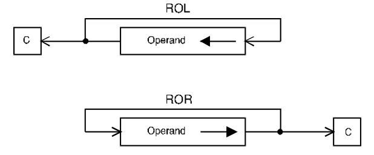

# ROL, ROR - Rotate left/right (without extend)

## Operation
[destination] ← [destination] rotated by \<count\>

## Syntax
```assembly
ROL Dx,Dy
ROR Dx,Dy
ROL #<data>,Dy
ROR #<data>,Dy
ROL <ea>
ROR <ea>
```

## Attributes
`Size` byte, word, longword

## Description
Rotate the bits of the operand in the direction indicated. The extend bit, X, is not included in the operation. A rotate operation is circular in the sense that the bit shifted out at one end is shifted into the other end. That is, no bit is lost or destroyed by a rotate operation. The bit shifted out is also copied into the C-bit of the CCR, but not into the X-bit. The shift count may be specified in one of three ways: the count may be a literal, the contents of a data register, or the value 1. An immediate count permits a shift of 1 to 8 places. If the count is in a register, the value is modulo 64, allowing a range of 0 to 63. If no count is specified, the *word* at the effective address is rotated by one place (e.g., `ROL <ea>`).



## Condition codes
|X|N|Z|V|C|
|--|--|--|--|--|
|-|*|*|0|*|

The X-bit is not affected and the C-bit is set to the last bit rotated out of the operand (C is set to zero if the shift count is 0).

## Destination operand addressing modes
|Dn|An|(An)|(An)+|&#x2011;(An)|(d,An)|(d,An,Xi)|ABS.W|ABS.L|(d,PC)|(d,PC,Xn)|imm|
|:-:|:-:|:-:|:-:|:-:|:-:|:-:|:-:|:-:|:-:|:-:|:-:|
|✓||✓|✓|✓|✓|✓|✓|✓||||

*From MOTOROLA M68000 FAMILY Programmer's reference manual. Copyright 1992 by Motorola Inc./NXP. Adapted with permission.*