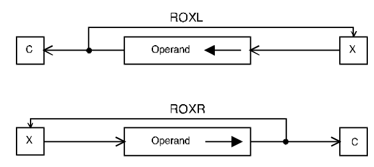

# ROXL, ROXR - Rotate left/right with extend

## Operation
[destination] ← [destination] rotated by \<count\>

## Syntax
```assembly
ROXL Dx,Dy
ROXR Dx,Dy
ROXL #<data>,Dy
ROXR #<data>,Dy
ROXL <ea>
ROXR <ea>
```

## Attributes
`Size` byte, word, longword

## Description
Rotate the bits of the operand in the direction indicated. The extend bit of the CCR is included in the rotation. A rotate operation is circular in the sense that the bit shifted out at one end is shifted into the other end. That is, no bit is lost or destroyed by a rotate operation. Since the X-bit is included in the rotate, the rotation is performed over 9 bits (`.B`), 17 bits (`.W`), or 33 bits (`.L`). The bit shifted out is also copied into the C-bit of the CCR as well as the X-bit. The shift count may be specified in one of three ways: the count may be a literal, the contents of a data register or the value 1. An immediate count permits a shift of 1 to 8 places. If the count is in a register, the value is modulo 64 and the range is from 0 to 63. If no count is specified, the word at the specified effective address is rotated by one place (i.e., `ROXL <ea>`).



## Condition codes
|X|N|Z|V|C|
|--|--|--|--|--|
|*|*|*|0|*|

The X- and the C-bit are set to the last bit rotated out of the operand. If the rotate count is zero, the X-bit is unaffected and the C-bit is set to the X-bit.

## Destination operand addressing modes
|Dn|An|(An)|(An)+|&#x2011;(An)|(d,An)|(d,An,Xi)|ABS.W|ABS.L|(d,PC)|(d,PC,Xn)|imm|
|:-:|:-:|:-:|:-:|:-:|:-:|:-:|:-:|:-:|:-:|:-:|:-:|
|✓||✓|✓|✓|✓|✓|✓|✓||||

*From MOTOROLA M68000 FAMILY Programmer's reference manual. Copyright 1992 by Motorola Inc./NXP. Adapted with permission.*